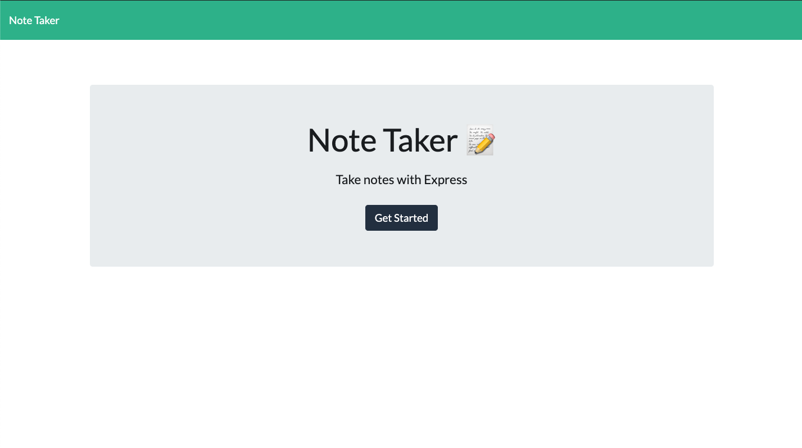
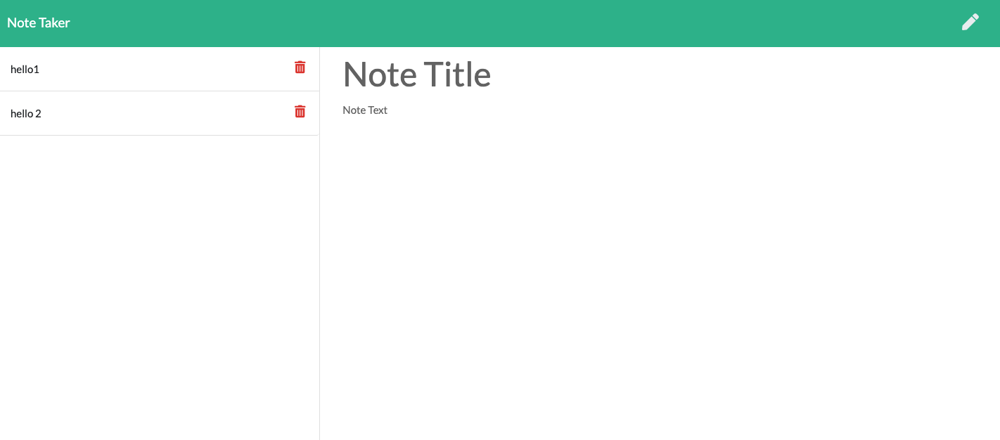

# Friendly 📝 Note Taker

## Description
This app is for users that need to keep track of a lot of information. It's easy to forget or be unable to recall something important. Being able to take persistent notes allows users to have written information available when needed.

## Table of Contents
* [Installation](#installation)
* [Usage](#usage)
* [Credits](#credits)
* [License](#license)
* [Contributing](#contributing)
* [Questions](#questions)

## Installation
### Steps required to run locally
1. Clone/download the code in this repo
2. Navigate to the location of the code downloaded
3. Double-click on the html file provided in the downloaded code to preview
### Steps required to run online
1. Click here to [VIEW DEMO](https://friendly-note-taker.herokuapp.com/)  

## Usage 
This code should be used for the purpose of creating/editing code for a note taker. This code has not been deployed to a live site. It must be run locally.

## Credits
1 contributor: @stopdaydreaming  
Special thanks to my amazing tutor.

## License
Copyright (c) Friendly Note Taker. All rights reserved.
Licensed under the [MIT](LICENSE) license.

## Features
None at this time

## Contributing
None at this time

## Tests
None at this time  

## Badges

